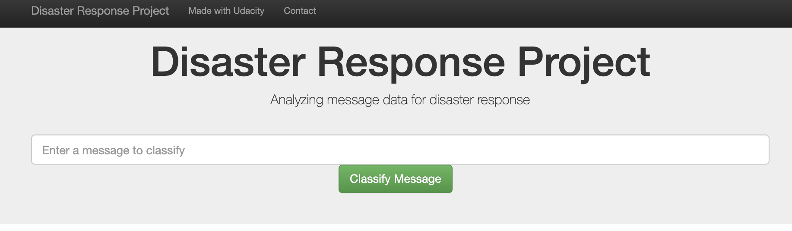
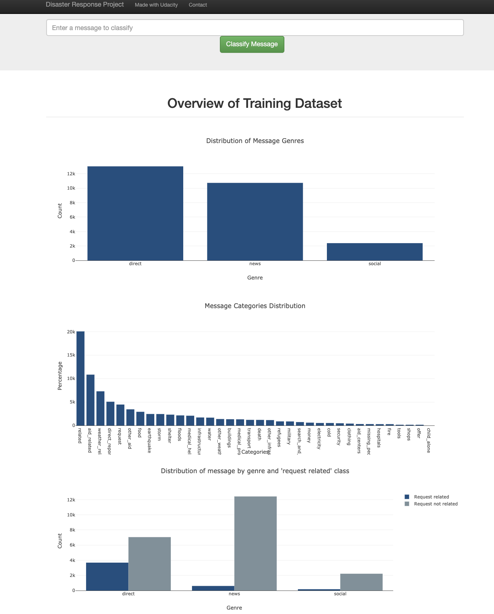
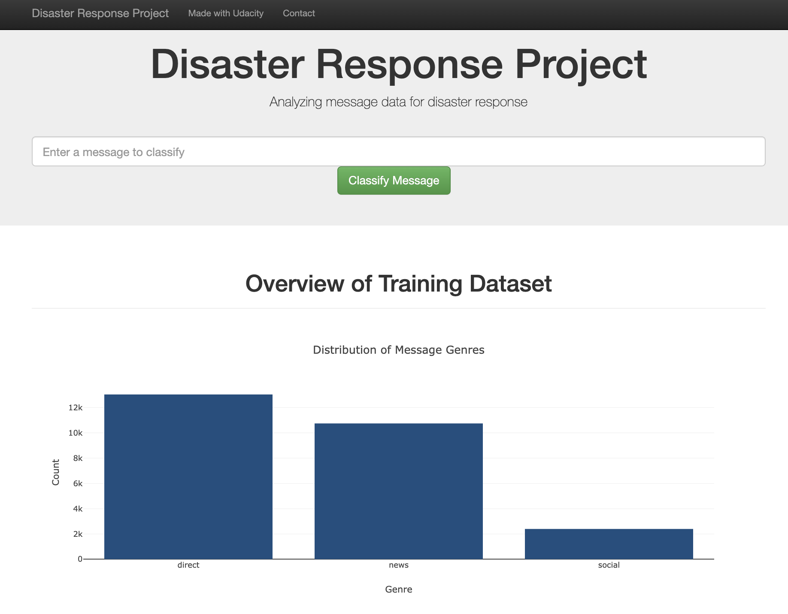
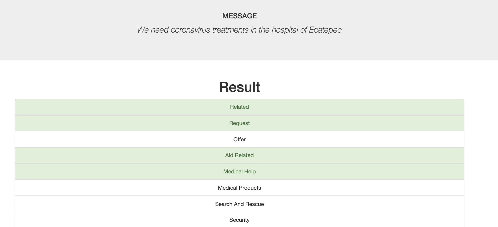

# Disaster Response Project

### Table of Contents

1. [Project Motivation](#motivation)
2. [Installation](#installation)
3. [File Descriptions](#files)
4. [Results](#results)
5. [Licensing, Authors, and Acknowledgements](#licensing)

## Project Motivation

In this project, I was interestested to analyze disaster data to build a Natural Language Processing Model for an API that classifies disaster messages in real time.

The project is divided in three sections:

* **Data Processing**: build an ETL (Extract, Transform, and Load) Pipeline to extract data from the given dataset, clean the data, and then store it in a SQLite database
* **Machine Learning Pipeline**: split the data into a training set and a test set. Then, create a machine learning pipeline that uses NLTK, as well as scikit-learn's Pipeline and GridSearchCV to output a final model that predicts a message classifications for the 36 categories (multi-output classification)
* **Web development** develop a web application to show classify messages in real time.

## Installation 
 
The code should run with no issues using Python versions 3.7.3 and the following libraries:
* [NumPy](http://www.numpy.org/)
* [Pandas](http://pandas.pydata.org)
* [nltk](https://www.nltk.org/)
* [scikit-learn](http://scikit-learn.org/stable/)
* [sqlalchemy](https://www.sqlalchemy.org/)
* [dash](https://plot.ly/dash/)

1. Run the following commands in the project's root directory to set up your database and model.

    - To run ETL pipeline that cleans data and stores in database
        `python data/process_data.py data/disaster_messages.csv data/disaster_categories.csv data/DisasterResponse.db`
    - To run ML pipeline that trains classifier and saves
        `python models/train_classifier.py data/DisasterResponse.db models/classifier.pkl`

2. Run the following command in the app's directory to run your web app.
    `python run.py`

3. Go to http://0.0.0.0:3001/

## File Description

    .
    ├── app     
    │   ├── run.py                           # Flask file that runs app
    │   └── templates   
    │       ├── go.html                      # Classification result page of web app
    │       └── master.html                  # Main page of web app    
    ├── data                   
    │   ├── disaster_categories.csv          # Dataset including all the categories  
    │   ├── disaster_messages.csv            # Dataset including all the messages
    │   └── process_data.py                  # Data cleaning
    ├── models
    │   └── train_classifier.py              # Train ML model           
    └── README.md

## Results

Type in: We need coronavirus treatments in the hospital of Ecatepec.

I deployed the aplication on a cloud platform. You can find it [here](https://dsp-disaster-response-app.herokuapp.com/).  

## Licensing, Authors, Acknowledgements

Must give credit to [Figure Eight](https://www.figure-eight.com/) for the datasets and more information about the licensing of the data can be find [here](https://www.figure-eight.com/datasets/).

